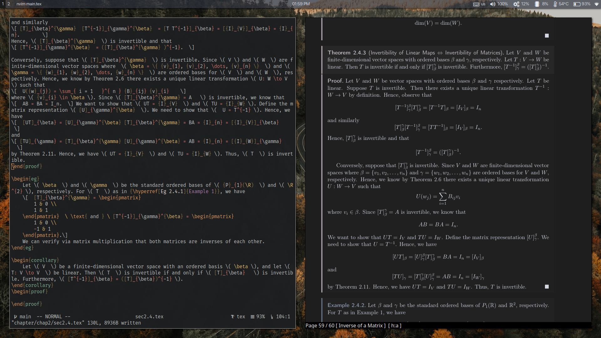

# nvim

 This setup is optimized for writing notes and doing homework in LaTeX. 
* Requires version 0.9.0+
* OS: Ubuntu 22.03
* Termimal: Alacritty
* Font in Screenshot: FiraCode https://www.nerdfonts.com/font-downloads
* Colorscheme: Melange
* PDF Viewer: Sioyek/Zathura (or SumatraPDF if you're on Windows)
* Snippets: Luasnip
* Completion: nvim-cmp

## Installation

First, install the dependencies and pdf-viewer. Since I'm on Ubuntu, the package manager is apt:

````
sudo apt install texlive-full latexmk sioyek
````
Then clone the repo into your `.config` directory:
````
git clone https://github.com/LanceRemigio/nvim
cd nvim 
nvim init.lua
````
## Screenshot




